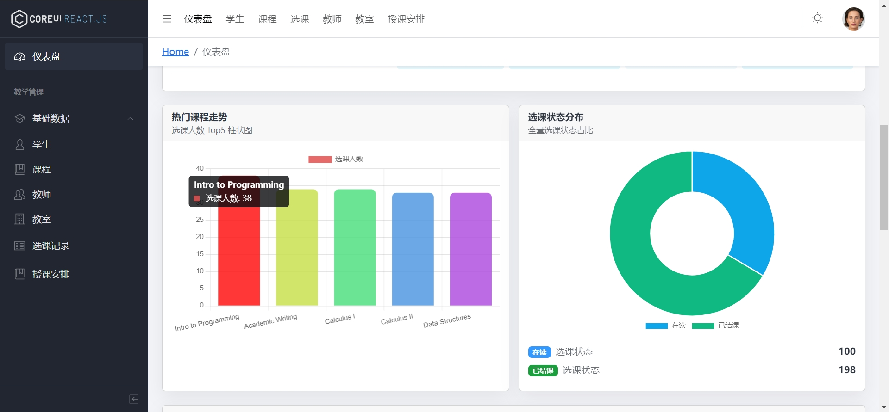
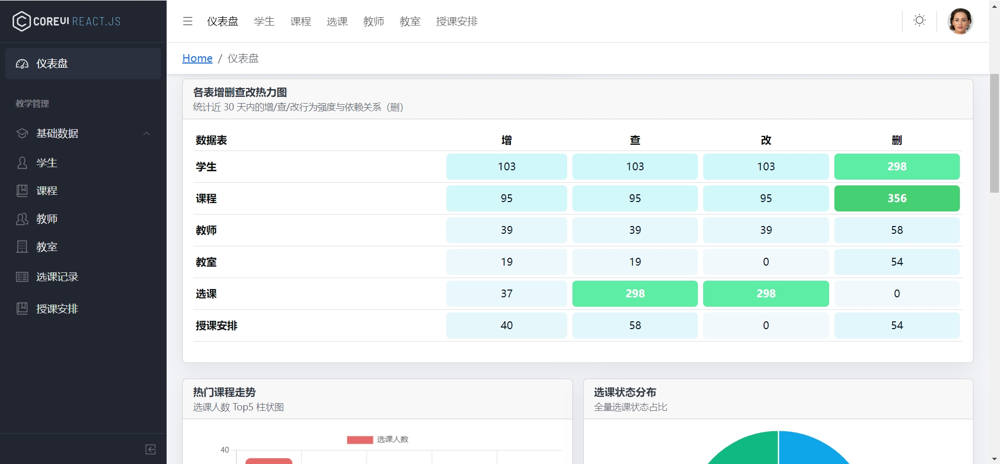
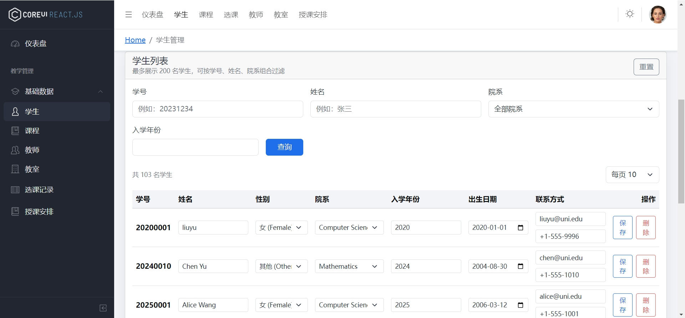
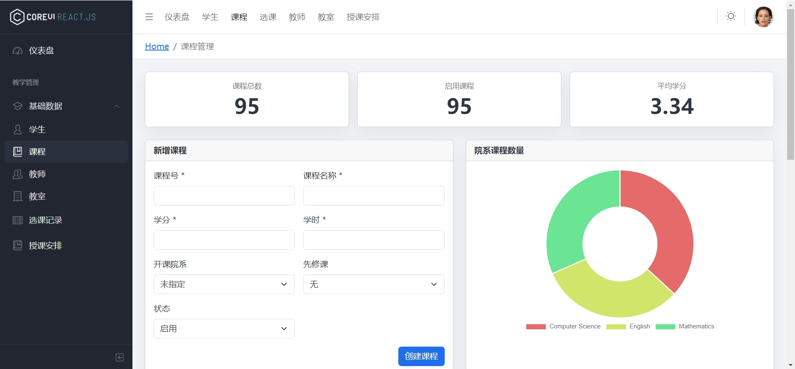
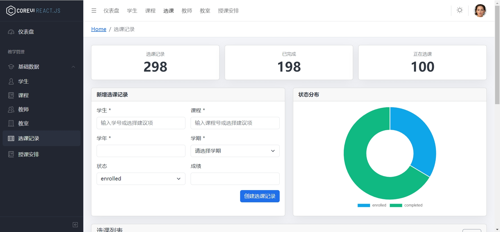
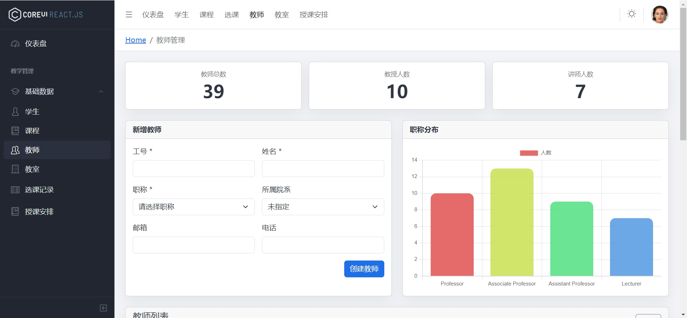
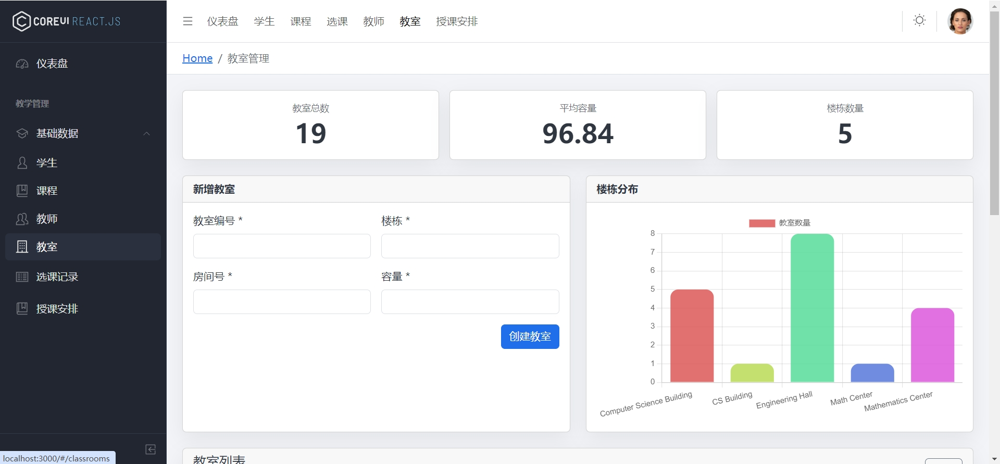
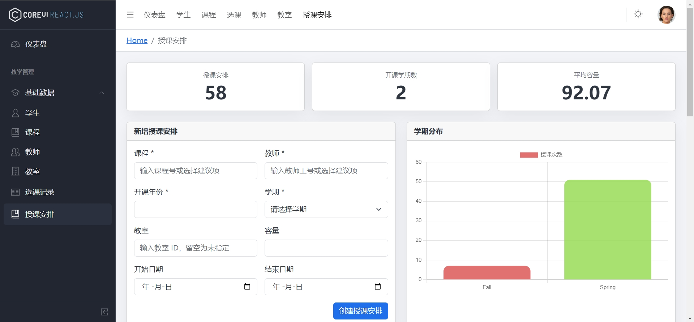

# 教务管理系统（EduMgmt-DBPractice）

**基于 MySQL + Flask + 前端 SPA 的学生教务管理系统**

> 本项目是我基于OUC《数据库系统》课程设计的综合性实践，包含数据库设计、完整性约束实现、前后端分离开发、可视化展示、多条件查询等完整功能。

------

## 🚀 项目技术栈

- **前端：** 原生 JS / Webpack / SPA
- **后端：** Flask + SQLAlchemy + RESTful API
- **数据库：** MySQL
- **架构：** 前后端分离，统一接口 `/api/v1/*`

------

# 📦 功能总览

系统首页提供了所有教务数据的聚合可视化，包括：

- 学生、课程、教师、教室、授课安排、选课记录等 **核心数据统计卡片**
- **增删查改操作热力图**（近 30 天）
- **Top5 热门课程柱状图**
- **选课状态（在修/已修）环形图**
- **最新选课记录实时流**

> Dashboard 片段截图

------

# 📚 1. 数据库设计

## 1.1 关系模式（共 11 张表）

数据库共包含以下表，覆盖真实教务系统所需的数据实体：

- Student（学生）
- Teacher（教师）
- Course（课程）
- Classroom（教室）
- Teaching（授课安排）
- SC（选课记录）
- Department（院系）
- TermDict（学期字典）
- GradeScale（成绩等级）
- CourseAggDaily（课程每日统计）
- Alembic 版本表

> 数据库截图

------

## 1.2 完整性约束设计

### ✔ 实体完整性

所有主键均设置 `PRIMARY KEY`，保证唯一与非空。

### ✔ 参照完整性

- `Course.Dno → Department.Dno`
- `Teaching.Cno → Course.Cno`
- `SC.Sno → Student.Sno`
- `SC.Term → TermDict.TermCode`
- …（共 12 条外键）

### ✔ 用户自定义完整性（CHECK/UNIQUE/ENUM/触发器）

包括：

- 容量范围、学分范围、学时范围检查
- 邮箱唯一、课程同院系唯一
- 性别/教师职称/选课状态 ENUM 域约束
- 触发器自动检测：
  - **先修课程是否形成环**
  - **学生是否满足选课先修要求**

> 完整性违约提示截图片段

------

# 💡 2. 实验亮点

## ⭐ 2.1 前后端分离架构

Flask 提供 REST API；前端独立构建界面与交互。

------

## ⭐ 2.2 可选项（metadata）接口：减少输入错误

后端 `/metadata` 提供一次性返回：

- 全部课程
- 全部教师
- 全部教室
- 全部学期

前端自动挂载到：

- `<datalist>`
- `<select>`

有效解决：

- 外键输入易错
- 用户体验不佳
- 引用关系复杂的问题

------

## ⭐ 2.3 完整性约束违约的统一提示机制

后端统一返回格式化错误，前端用拦截器弹窗展示：

- 外键不存在
- 容量不合法
- 先修课程环
- 删除被引用数据

------

## ⭐ 2.4 可视化统计（图表）

- 热力图
- 柱状图
- 环形图
- Top5 课程
- 最新选课记录

------

## ⭐ 2.5 多条件组合查询

支持按任意组合过滤：

- 课程号
- 教师号
- 学年
- 学期
- 状态（选课）

后端动态拼接查询条件；前端保存条件避免翻页丢失。

------

# 🧩 3. 功能模块展示

## 🔹 3.1 仪表盘（Dashboard）

- 六大统计卡片（学生/课程/教师/教室/选课/活跃学期）
- 热力图
- Top5 课程
- 选课状态
- 最新记录流

------

## 🔹 3.2 学生管理模块

- 新增学生
- 分性别/院系统计图
- 列表行内编辑
- 多条件查询

------

## 🔹 3.3 课程管理模块

- 新增课程
- 启用/停用
- 学分/学时/先修课程管理
- 饼图展示院系课程类目

------

## 🔹 3.4 选课记录模块（核心）

- 自动提示学号和课程号
- 成绩管理
- 状态管理（在读/已结课）
- 多条件组合筛选

------

## 🔹 3.5 教师管理模块

- 教师新增
- 职称柱状图
- 查询 + 行内编辑

------

## 🔹 3.6 教室管理模块

- 教室新增（楼栋/房间/容量）
- 楼栋分布柱状图
- 行内编辑 + 删除校验

------

## 🔹 3.7 授课安排模块（最复杂模块）

- 课程 + 教师 + 教室 + 学期 四重外键
- 多条件筛选
- 容量/日期编辑
- 学期授课数图表

